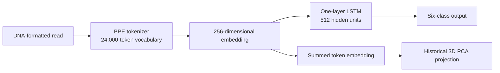

# Viral Genomic Read Classifier

An inference-only restoration of a Bio AI project originally developed in
2022. The project applies NLP-style representation learning to short genomic
reads: a BPE tokenizer converts nucleotide sequences into variable-length
tokens, and an LSTM assigns each read to one of six classes.

The original Dash/Heroku demo has been replaced with a tested Gradio interface.
The 2022 notebooks and saved outputs remain available as an explicit historical
archive.

> **Research demonstration only. This application is not a clinical diagnostic
> tool.** Model scores classify individual reads and are not probabilities that
> a patient has a particular infection.

## What the demo shows

- Six-class model output and the highest-scoring read class
- BPE tokens produced from the submitted nucleotide sequence
- A 3D PCA projection of the learned embedding alongside sampled references
- Clear validation and interpretation boundaries

The maintained application accepts DNA-formatted reads containing `A`, `C`,
`G`, and `T`, from 20 through 1,000 nucleotides. The synthetic reads used by the
original work were 150 nucleotides long.

## Model flow



The classes follow the source PACIFIC task:

1. Coronaviridae other than SARS-CoV-2
2. Human transcriptome
3. Influenza
4. Metapneumovirus
5. Rhinovirus
6. SARS-CoV-2

## Run locally

Python 3.10–3.13 is supported.

```bash
python -m venv .venv
source .venv/bin/activate
python -m pip install -r requirements.txt
python app.py
```

Open the local URL printed by Gradio. No training dataset is required for the
inference demo; the required historical artifacts are included in the
repository.

## Run tests

Install the development dependency and execute the suite:

```bash
python -m pip install 'pytest>=8,<10'
python -m pytest -v
```

The tests cover nucleotide validation, artifact loading, deterministic model
output, probability invariants, PCA projection, Plotly figures, and Gradio
callback behavior.

## Repository layout

```text
.
├── app.py                    # Gradio entry point
├── artifacts/                # Runtime tokenizer, weights, labels, and PCA data
├── src/viral_classifier/     # Maintained model, prediction, and plotting code
├── tests/                    # Unit and application smoke tests
├── archive/2022/             # Original notebooks, Dash app, code, and results
└── docs/superpowers/         # Restoration design and implementation plan
```

The application resolves artifacts relative to the repository, so inference
does not depend on the shell's current working directory. The model and
reference projection are loaded once per application process.

## Artifact provenance

The canonical classifier is the state dictionary referenced by the final 2022
Dash application (`sgrnn_emb_ftrue.pth`, now `artifacts/classifier.pth`). The
alternative `model.pth` is preserved in `archive/2022/artifacts/`. Both match a
24,000 × 256 embedding, a one-layer 512-unit LSTM, and six output classes.

The historical PCA object was serialized with scikit-learn 1.0.2. To avoid
depending on an incompatible estimator method, the maintained predictor reads
its saved `mean_` and `components_` arrays and applies the equivalent linear
projection directly.

## Historical evaluation and limitations

The original 2022 experiment reported 99.5% accuracy on a random held-out split
of synthetic PACIFIC-derived reads. This repository does not treat that score
as evidence of clinical performance, novel-virus detection, or generalization
to unseen genome assemblies. The restoration does not reproduce that training
run or resolve inconsistencies in the original experiment report about which
embedding configuration produced each score.

Important limitations include:

- The original split was performed at the read level; separation by source
  genome or accession was not demonstrated.
- The current model is a closed-set classifier and cannot establish that an
  input represents a novel virus.
- Synthetic-to-real domain shift was not evaluated in this restoration.
- Softmax outputs are not calibrated clinical probabilities.
- PCA proximity is a visualization of one learned representation, not a
  phylogenetic or taxonomic distance.

See [`archive/2022/README.md`](archive/2022/README.md) for the original notebook
flow and environment constraints.

## Data source

The original project used synthetic training reads published with PACIFIC:

> Acera Mateos, P., Balboa, R. F., Easteal, S., Eyras, E., & Patel, H. R.
> (2021). PACIFIC: a lightweight deep-learning classifier of SARS-CoV-2 and
> co-infecting RNA viruses. *Scientific Reports, 11*, 3209.
> https://doi.org/10.1038/s41598-021-82043-4

The original report and notebooks contain the broader bibliography used in
2022.
