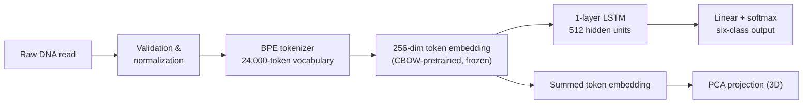
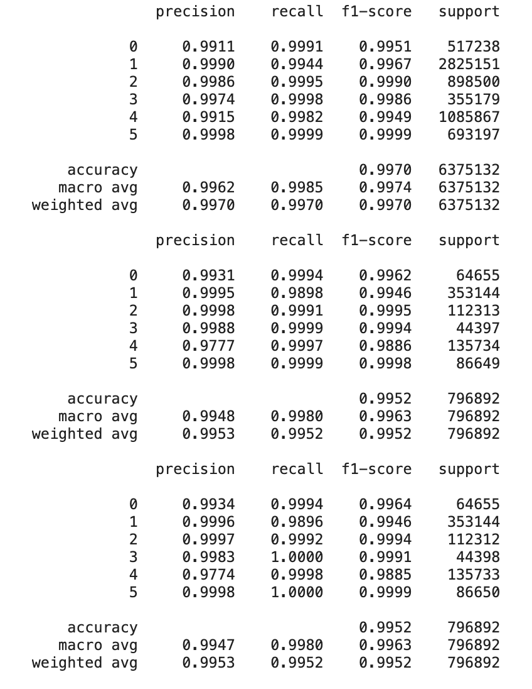
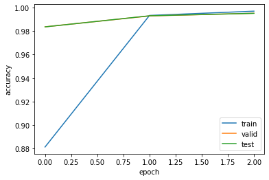

# Viral Genomic Read Classifier

Can NLP-style representation learning on nucleotide subsequences classify
short viral genomic reads? This project applies byte-pair-encoding (BPE)
tokenization and a learned embedding space — originally pretrained with a
CBOW-style objective — to feed an LSTM classifier that assigns short DNA
reads to one of six respiratory-pathogen classes.

Full project write-up: [Virus Classification Project Report](https://serious-cord-d5d.notion.site/Virus-Classification-Project-Report-f89b1f7d12a0401c8c1fce2a10117d83)

## Problem

High-throughput sequencing produces large volumes of short reads rather than
whole assembled genomes. Classical read classification (e.g. Kraken2)
compares fixed-length k-mers against large reference databases, which is
memory-hungry and forces a single k-mer length onto features that vary in
size. This project instead frames read classification as an NLP-style
problem: given one short nucleotide read, tokenize it with a learned,
variable-length vocabulary and classify it into one of six known respiratory
pathogen classes. It does not attempt open-set detection of novel pathogens,
assembly, or alignment-based identification.

## Data source

Training used the synthetic reads published with PACIFIC:

> Acera Mateos, P., Balboa, R. F., Easteal, S., Eyras, E., & Patel, H. R.
> (2021). PACIFIC: a lightweight deep-learning classifier of SARS-CoV-2 and
> co-infecting RNA viruses. *Scientific Reports, 11*, 3209.
> https://doi.org/10.1038/s41598-021-82043-4

These are ART-simulated short reads (150 nt in the source data; the deployed
model accepts 20–1,000 nucleotide DNA-formatted `A`/`C`/`G`/`T` reads),
substantially imbalanced across classes — from 532,881 reads
(Metapneumovirus) to 3,531,439 reads (Human, the control class) — which the
training procedure addresses with inverse-frequency class weighting in the
loss. See [`training/README.md`](training/README.md) for the full per-class
breakdown and training methodology.

## Target classes

1. Coronaviridae other than SARS-CoV-2
2. Human transcriptome
3. Influenza
4. Metapneumovirus
5. Rhinovirus
6. SARS-CoV-2

## Method

The pipeline has two representation-learning stages before classification,
not a single end-to-end BPE→LSTM model:



1. **Tokenization.** A BPE tokenizer is trained on the nucleotide corpus,
   producing a 24,000-token vocabulary of variable-length subsequences
   rather than fixed k-mers.
2. **Embedding pretraining.** Token embeddings (256-dim) are pretrained with
   a CBOW-style objective: each token is predicted from the sum of its
   neighboring tokens' embeddings within a window. This is unsupervised —
   it uses no class labels.
3. **Classification.** An LSTM (1 layer, 512 hidden units) is trained on the
   six-class task on top of the pretrained embedding, which is **frozen**
   during this stage (the deployed weight file's name records this
   configuration — embedding freeze=True). The last timestep's hidden state
   is passed through a linear layer to six logits.
4. **Visualization (optional, decoupled from classification).** The token
   embeddings for a read are summed and projected into 3D with a
   pre-fit PCA transform, alongside a sample of reference reads' embeddings,
   to give a qualitative view of the learned representation. This path does
   not affect the predicted class or score.

Because the embedding is frozen when the classifier is trained, the
representation the LSTM consumes is fixed evidence about subsequence
co-occurrence in the reads, not something the classifier itself shapes —
closer in spirit to using pretrained word embeddings for a downstream NLP
model than to a jointly learned embedding+classifier. This is the
configuration actually shipped in `artifacts/`; see
[`training/README.md`](training/README.md) for the supporting evidence and
the reference implementation of each pipeline stage.

## Evaluation results

The shipped model (`artifacts/classifier.pth`) is the **frozen
pretrained-embedding** configuration. The original report's results table
attributes its best score — F1 > 0.995, the often-quoted **99.5% accuracy**
— to a *different* configuration (embeddings trained from scratch, no CBOW
pretraining), and the report's own discussion section contradicts that
table. This repository does not resolve that inconsistency; see
[`training/README.md`](training/README.md#what-was-actually-shipped-and-the-accuracy-discrepancy)
for the full evidence trail. The plots below are the original run's
training curve and per-class report, included as evidence for the reported
numbers rather than as a guarantee of the current artifacts' exact
performance — none of these runs have been reproduced in this repository:

| | |
|---|---|
|  |  |

## Limitations

- **Read-level split.** The held-out split was performed at the read level,
  not by source genome or accession, so it does not demonstrate
  generalization to unseen genomes.
- **Closed-set only.** The classifier assumes every input belongs to one of
  the six trained classes; it cannot flag a genuinely novel virus.
- **Synthetic-to-real domain shift is untested.** Training and evaluation
  both used synthetic PACIFIC-derived reads; performance on real sequencer
  output is unknown.
- **Softmax scores are not clinical probabilities.** They are relative
  class scores for a single 150-nt-scale read, not calibrated,
  patient-level probabilities of infection.
- **PCA distance is not phylogenetic distance.** The 3D projection reflects
  proximity in one learned embedding space, not evolutionary or taxonomic
  relatedness.
- **Unresolved accuracy attribution.** As detailed above, the source
  project's own report disagrees with itself about which embedding
  configuration produced its best score; this repository reports the
  discrepancy rather than resolving it.

## Run the demo

Python 3.10–3.13 is supported.

```bash
python -m venv .venv
source .venv/bin/activate
python -m pip install -r requirements.txt
python app.py
```

Open the local URL printed by Gradio and submit a DNA-formatted read
(`A`/`C`/`G`/`T`, 20–1,000 nucleotides). All artifacts needed for inference
(tokenizer, weights, labels, PCA transform, reference embeddings) are
included in `artifacts/`; no dataset or training step is required.

## Run tests

```bash
python -m pip install 'pytest>=8,<10'
python -m pytest -v
```

Tests cover sequence validation, artifact loading, deterministic model
output, probability invariants, PCA projection, Plotly figure construction,
and the Gradio callback.

## Repository structure

```text
.
├── app.py                    # Gradio entry point
├── artifacts/                # Tokenizer, classifier weights, labels, PCA, reference embeddings
├── docs/evaluation/           # Training/evaluation plots referenced above
├── src/viral_classifier/      # Validation, model, predictor, visualization
├── training/                  # Reference training pipeline (tokenizer, CBOW, LSTM, PCA analysis)
└── tests/                     # Unit and application smoke tests
```

The application resolves artifact paths relative to the repository, so
inference does not depend on the shell's working directory. The model and
reference projection are loaded once per process (`ViralReadPredictor.load_default`).
